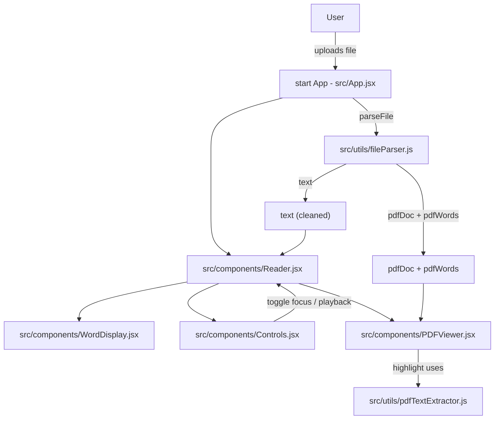

# q-read

A speed-reading web app inspired by RSVP (Rapid Serial Visual Presentation).

## Features
- Paste text and read word-by-word
- Adjustable WPM
- Pivot letter highlighting
- Play / Pause / Restart

## Tech Stack
- React (Vite)
- JavaScript
- CSS

## Getting Started

```bash
git clone https://github.com/RyanEAA/q-read.git
cd q-read
npm install
npm run dev
```

## Project Overview

This project presents text one word at a time (RSVP) and supports uploaded PDFs with an overlay that highlights the current word in the original document. The core idea is that a single word index drives both the RSVP display and the PDF highlight overlay when a PDF is loaded.

### Key Files & Purpose

- `src/App.jsx`: Top-level app. Handles file upload and keeps two parallel representations of the document when a PDF is uploaded: the cleaned RSVP text (`text`) and the PDF document object plus per-word coordinates (`pdfDoc` and `pdfWords`). Passes these into `Reader`.
- `src/components/Reader.jsx`: Main reading screen. Owns RSVP state (current word `index`, WPM, playback) and decides which view to render. When a PDF is present it can show the original PDF with highlighted word or switch to a focus-only RSVP mode. It coordinates the active PDF word by using the same index used by the RSVP flow.
- `src/components/WordDisplay.jsx`: Renders the RSVP word in the centered reader. Also supports an overlay mode (when a PDF is visible and focus is off) so the RSVP word can be shown on top of the PDF.
- `src/components/Controls.jsx`: Playback and control UI (play/pause, restart, WPM slider, TTS toggle). Adds a `Focus` toggle when a PDF is loaded to switch between focus-only RSVP and PDF-with-overlay modes.
- `src/components/PDFViewer.jsx`: Renders PDF pages using `pdfjs-dist`. When provided `activeWord` (with page/x/y/width/height) it draws a highlight box over the correct page at the calculated coordinates.
- `src/utils/fileParser.js`: Handles uploaded files. For plain text it returns cleaned text. For PDFs it uses `pdfjs-dist` to load the document and `src/utils/pdfTextExtractor.js` to extract per-word bounding boxes plus the text. Returns both `text` (cleaned) and `pdfDoc`/`pdfWords` so the app can drive both views from the same index.
- `src/utils/pdfTextExtractor.js`: Uses `pdfjs-dist` page text content and viewport transforms to compute per-word coordinates in canvas/view space. Exports a shared `SCALE` used by the viewer so coordinates and render size match.
- `src/utils/textParser.js`: Small helpers to clean text, split into words, and compute RSVP timing (pause lengths for punctuation, pivot index for highlighting, etc.).

### How it connects (high level)

- Uploading a PDF: `App` -> `fileParser.parseFile()` -> returns `{ text, pdfDoc, pdfWords }`.
- `App` passes `text`, `pdfDoc`, and `pdfWords` to `Reader`.
- `Reader` maintains a single `index` into the word list derived from `text`.
- When a PDF is present, `Reader` maps the current `index` to a word entry in `pdfWords` (which includes page and bounding box) and passes that as `activeWord` into `PDFViewer` for the highlight overlay.
- The `Controls` component toggles focus mode; when focus is on the app shows only the RSVP word; when focus is off the PDF is visible and the RSVP word renders as an overlay while the PDF shows the highlighted word region.

### Notes / Tips

- `pdfjs-dist` is a large dependency; the build emits a large `pdf.worker` chunk (this is expected). Consider dynamic import or code-splitting if you want to reduce initial bundle size.
- The overlay and highlight rely on pixel coordinate mapping; if you change the `SCALE` constant in `pdfTextExtractor.js` update the import in `PDFViewer.jsx` so rendered canvas sizes and bounding boxes continue to match.

If you'd like, I can add a short diagram or keyboard shortcut reference next (e.g., toggle focus with `F`).

### Architecture Diagram



### Keyboard Shortcuts

- `Space`: play / pause
- `← / →`: move word by word
- `↑ / ↓`: change speed
- `F`: toggle focus mode (when a PDF is loaded)
